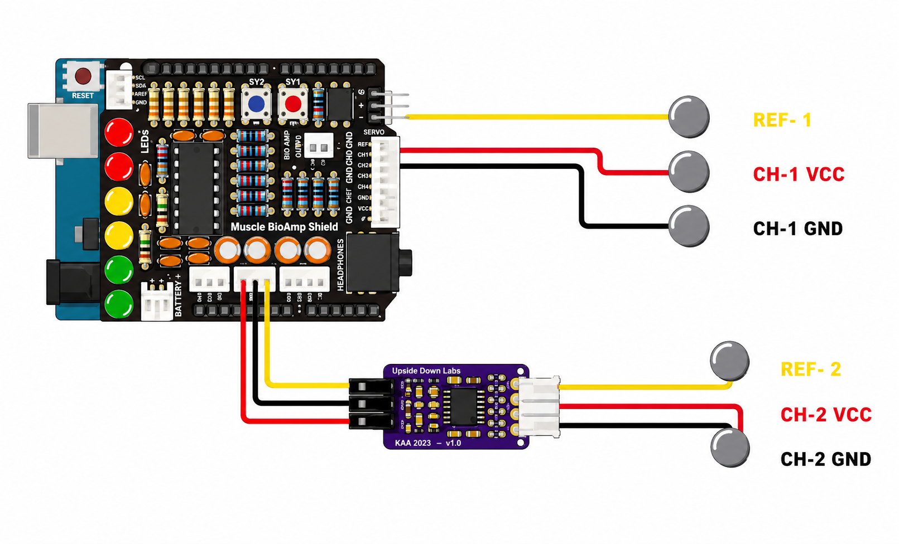
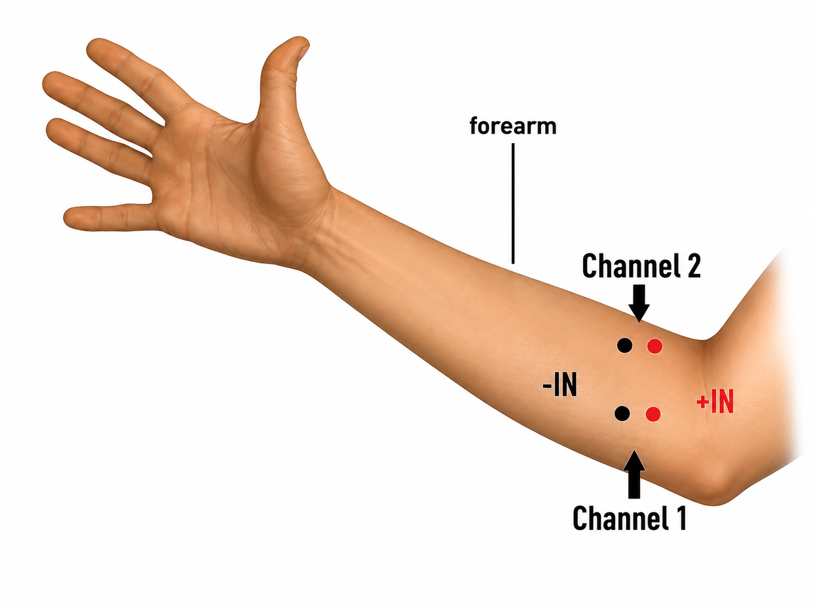
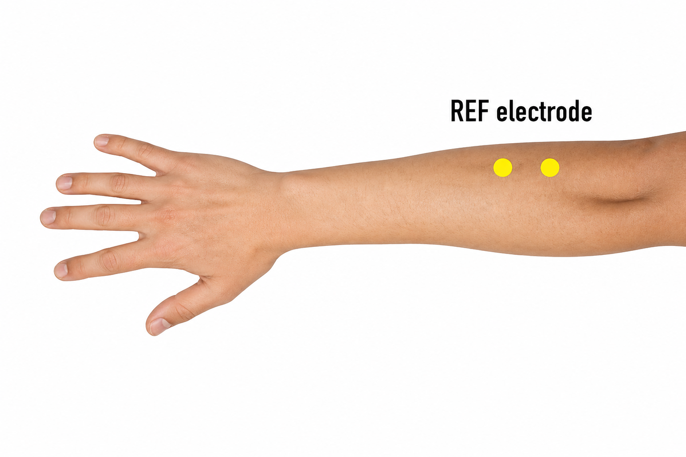

# Hardware Setup

This project uses an EMG (Electromyography) sensor setup to detect muscle activity and classify hand gestures using machine learning. The hardware is based on the Upside Down Labs BioAmp ecosystem connected to an Arduino.

## Required Components

* Arduino R3
* Upside Down Labs Muscle BioAmp Shield [buy](https://store.upsidedownlabs.tech/product/muscle-bioamp-shield-v0-3/)
* BioAmp EXG Pill [buy](https://store.upsidedownlabs.tech/product/bioamp-exg-pill/)
* EMG electrodes [buy](https://store.upsidedownlabs.tech/product/bioamp-cable-v3/)
* Jumper wires [buy](https://store.upsidedownlabs.tech/product-category/accessories/)
* USB Type A to B cable 
* Computer running Python 

## Hardware Connections

Mostly same design, use this as the tutorial https://www.youtube.com/watch?v=zJ_Ei5tvHiQ

### Step 1 — Attach the Shield

Align the pins of the **Muscle BioAmp Shield** with the Arduino headers and carefully mount it onto the Arduino.

### Step 2 — Connect the EXG Pill

Use jumper wires to connect the **BioAmp EXG Pill** to the shield.

| BioAmp Shield | BioAmp EXG Pill |
| ------------- | --------------- |
| VCC           | VCC             |
| GND           | GND             |
| CH1 / OUT     | OUT             |

Make sure all connections are secure and correctly aligned.

### Step 3 — Connect Electrodes

Place the EMG electrodes according to the following diagram:

* **REF** electrode acts as the reference signal
* **CH VCC** electrode connects to the positive muscle signal
* **CH GND** electrode connects to the negative muscle signal

Proper electrode placement is extremely important. Incorrect placement can result in noisy signals or complete detection failure.

## Wiring Diagram

## Electrode Placement Tips

* Clean the skin before attaching electrodes
* Place electrodes firmly on the muscle
* Avoid loose connections
* Keep wires stable to reduce motion noise
* Position the reference electrode on a less active area

## Electrode Placement Diagram

## Powering the Device

Connect the Arduino to your computer using the USB cable. The board will power both the shield and the EXG module.

## Signal Verification

Before running the gesture detection model:

1. Upload the signal visualization script
2. Open the serial plotter or Python visualizer
3. Flex your muscle and confirm that the EMG signal changes

If the signal looks flat or extremely noisy:

* Recheck electrode placement
* Verify jumper connections
* Ensure the electrodes have good skin contact

#### For any help/issues contact me at https://www.instagram.com/atharvak.dev/ 
